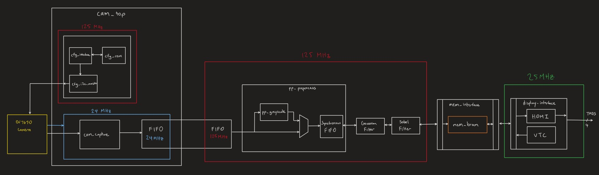
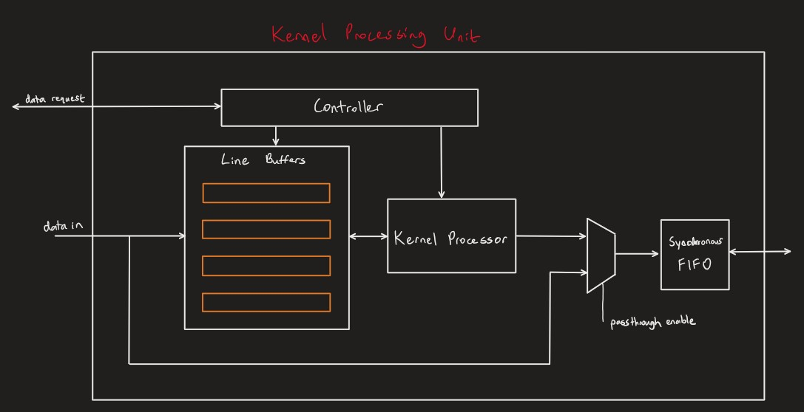

# Video Filtering on Artix-7 FPGA

- This project implements a video processing pipeline that captures video data from an OV7670 camera and applies a Gaussian lowpass filter and a Sobel edge detection filter.

- Documentation is pretty messy at this point, will be cleaned up soon.

__High-level Overview__
- High level system design

- Each block has a 'flush' control signal that's driven by a top-level control module (sys_control) that is not pictured. FIFOs are cleared and memory pointers where applicable are cleared.
- The flush signal is held until the next start of frame indicated by the OV7670 camera.
- The pipeline is flushed whenever a filter is enabled/disabled. 
- Note: mem_bram infers FPGA block memory.

- Kernel Processor high-level design

- Line buffers use a synthesis directive to forcibly synthesize DRAM.

__Demos__
- These demos reflect a work in progress until no longer noted here.
- Click the images below to view Youtube videos.

