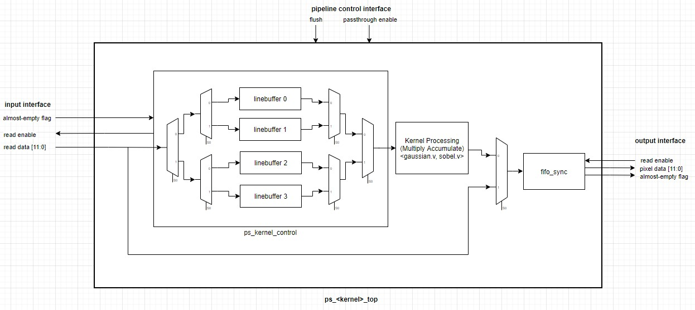

# Video Filtering on Artix-7 FPGA


__Description:__

This project implements a video processing pipeline that captures video data from an OV7670 camera and applies a Gaussian lowpass filter and a Sobel edge detection filter. 

Users can use the buttons and switches on the dev board to interact with the video processing system.
- Video processing can be toggled on and off (video passthrough)
- Gaussian and Sobel filters can be enabled or disabled seperately
- Sobel filter thresholding can be changed by using the board buttons.

The project is completed; more documentation to come when I have time.

__High-level Overview:__

- The system is comprised of a camera interface block, preprocessing block, and gaussian and sobel filtering blocks.
- Processed video data is stored into a framebuffer synthesized as block memory where it is retrieved for display over HDMI.
- In RGB video passthrough mode, pixels are represented in RGB444 format and extended to RGB888 for TMDS encoding.
- In video processing modes, pixels are represented as eight-bit greyscale values. 
- Display format is 640x480 30FPS.

__Camera Interface:__

- The camera interface configures the OV7670 camera via i2c and captures pixel data (RGB444) into an asynchronous FIFO.

__Preprocessing (RGB to Greyscale):__

- The preprocessing block converts RGB444 to greyscale for filtering. It uses the algorithm ```y = 0.299*R + 0.587*G + 0.114*B```. 
- The algorithm is implemented using bit-shifts, see ```docs/notes.txt```.

__Kernel Processing:__

Both the Gaussian and Sobel filters are implemented using the designs shown above. 
- A kernel control module (ps_kernel_control) fetches data from the FIFO of the previous stage in the 
system pipeline and fills the line buffers sequentially. 
- Once three line buffers are full, it begins to feed pixel data 9 pixels at a time (3 from each line) 
to the kernel processing pipeline. 
- The output from the kernel processing pipeline is written to a synchronous FIFO.

Gaussian:


Sobel:

Some noteworthy design features:
- Technically, the Sobel operator is expressed as ```G = sqrt(Gx^2 + Gy^2)``` .
- To avoid doing the square root (doable, but would need a CORDIC), thresholding is used instead.

__Demos__
- Click the images below to view Youtube videos.
[](https://www.youtube.com/watch?v=dFgFBZIkOFI)
[](https://www.youtube.com/watch?v=nitLR1SwYG0)


